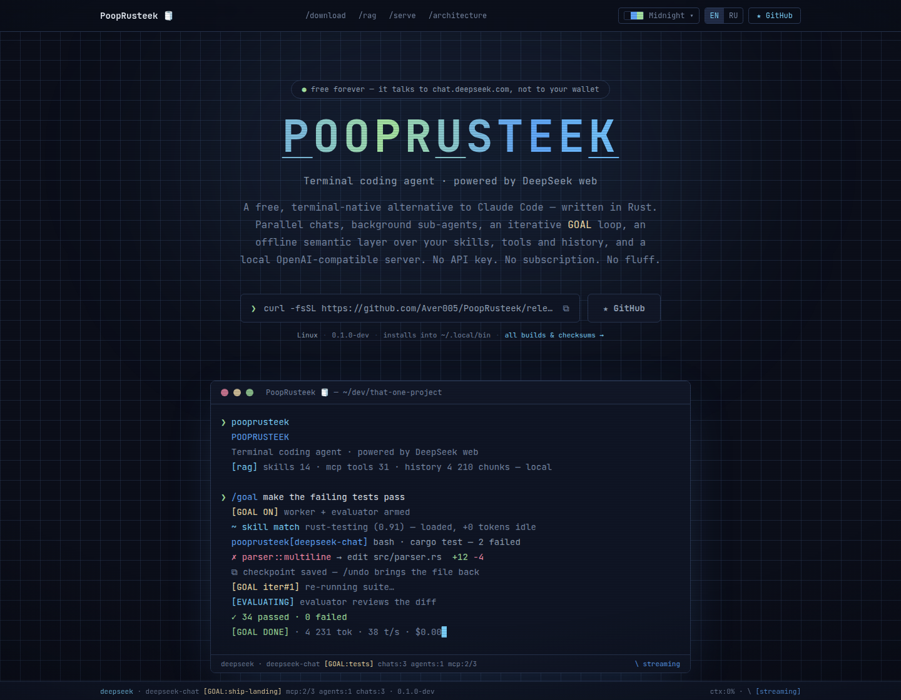

<div align="center">

# 🧻 pooprusteek-landing

**The website for [PoopRusteek](https://github.com/Aver005/pooprusteek) —
a free, terminal-native Rust coding agent with an unapologetic name.**

*Terminal coding agent · powered by DeepSeek web · $0.00/month forever*

[](https://bun.sh)
[](https://vite.dev)
[](https://react.dev)
[](https://www.typescriptlang.org)
[](https://tailwindcss.com)
[](https://motion.dev)



*Yes, the terminal actually types that, in a loop, forever. It's very committed.*

</div>

---

## What this is

A five-page site that sells PoopRusteek the way it deserves: **as a TUI**.
The palette is lifted verbatim from the agent's `src/tui/theme.rs`, the hero
logo replays the TUI's staggered letter-pulse, the whole page sits under a
CRT scanline overlay, and the bottom of the screen is a working replica of
the real status bar.

Two things it does that a static landing usually doesn't:

- **It hands you the build.** The download buttons are wired to the GitHub
  release API — real file names, real sizes, real SHA-256 digests, and the
  install command that works *today* (including the channel flag, while the
  tagged stable release still predates the installers).
- **It wears the agent's themes.** The gallery is the real preset table from
  `theme.rs`; picking one rewrites the CSS custom properties the entire site
  is built on, CRT tint included.

## Pages

| Route | What's on it |
|---|---|
| `/` | Hero with an OS-aware download action, install tabs, `$0.00` ledger, 12 capability cards, the RAG and `/serve` teasers, the GOAL loop, the command marquee, the theme gallery |
| `/download` | Release badge (channel · version · date · live-or-cached), install tabs, every asset in the release with sizes and digests, channel switch, verification, self-update, first launch, requirements, uninstall |
| `/rag` | The offline retrieval layer: dense + lexical + RRF, three corpora, deferred MCP schemas, `/search`, every knob, and what happens when a piece is missing |
| `/serve` | The agent as a local OpenAI-compatible gateway: starting it, model-id routing, clients, and the defaults that keep it on loopback |
| `/architecture` | One `tokio::select!` loop, a turn end to end, the module map, the safety rails, and the evidence behind the numbers |

Routing is ~60 lines of `useSyncExternalStore` over the History API
(`src/lib/route-store.ts`). Deep links work because the host falls back to
`index.html` for extensionless paths under the slug.

## Quick start

Bun only — no npm, no pnpm, no lockfile archaeology.

```sh
bun install
bun dev        # http://localhost:5173/pooprusteek/
```

| Script | What |
|---|---|
| `bun dev` | Vite dev server with HMR |
| `bun run build` | `tsc -b && vite build` → `dist/` |
| `bun run preview` | Serve `dist/` at `http://localhost:4173/pooprusteek/` |
| `bun run lint` | oxlint |

## How the download buttons decide what to offer

```
GET /repos/Aver005/pooprusteek/releases     (once per visit, cached 30 min)
        │
        ├─ stable = newest non-prerelease        ── shown on /download
        ├─ dev    = the rolling `dev` tag        ── shown on /download
        │
        └─ recommended = the newest release that actually carries
                         pooprusteek-setup.exe, install.sh and every
                         platform binary  →  every button and command
                                             on the site points here
```

If GitHub doesn't answer (rate limit, offline, blocked), a static fallback
built from the rolling `dev` tag renders instead — the links still work, only
the sizes and the date go missing. `src/lib/install.ts` then spells the
matching command: while `recommended` is the dev build, the one-liner carries
`-s -- --channel dev`, because `install.sh` on the stable channel reads
`releases/latest/download/manifest.json` and that only exists once a stable
release ships the full asset set.

## Deploy

The same source is published in two places:

| Where | Base | How |
|---|---|---|
| **https://pooprusteek.github.io** | `/` | push to `main` of `PoopRusteek/pooprusteek.github.io` → `.github/workflows/pages.yml` |
| **https://aaaver.ru/pooprusteek/** | `/pooprusteek/` | push to `develop` of `Aver005/pooprusteek-landing` → `demo.yml` → `sites-updater` |

```sh
git remote add pages https://github.com/PoopRusteek/pooprusteek.github.io.git
git push origin develop          # aaaver.ru
git push pages develop:main      # GitHub Pages
```

Both builds declare `pooprusteek.github.io` as canonical, so search engines
don't treat them as competing copies. GitHub Pages has no SPA fallback, which
is why the build writes a small HTML shell per route (`download/index.html`,
`rag/index.html`, …) with its own title and description, plus a `404.html`.

aaaver.ru hosting is **aaaver-app**, a Bun server that maps
`sites/<slug>/` → `https://aaaver.ru/<slug>/`:

```
push to develop
      │
      ▼
.github/workflows/demo.yml → aaaver-app/site-release.yml
      │            builds dist/ and publishes the `latest` release
      ▼            with dist.tar.gz
sites-updater (on the VDS, polls every 10 min)
      │            downloads, unpacks, atomic rename
      ▼
https://aaaver.ru/pooprusteek/        live, zero downtime, no restart
```

The one rule everything hangs on: **the default `base` in `vite.config.ts`
(`/pooprusteek/`) must equal the aaaver slug**, and the Pages build overrides
it with `SITE_BASE=/`. The router strips whichever base was built in.

## Design system

Colors are not designed here — they are **imported truth** from
`pooprusteek/src/tui/theme.rs`. The `default` preset is declared as Tailwind
tokens in `src/index.css` (`@theme`); all ten presets live in
`src/lib/themes.ts` and any of them can be written onto `:root` at runtime.

| Token | Midnight | TUI origin |
|---|---|---|
| `ink` | `#0B0E19` | `THEME.bg` |
| `panel` / `panel-deep` | `#111727` / `#0F1524` | `THEME.panel` / `THEME.input_bg` |
| `fg` | `#E2E8F0` | `THEME.fg` |
| `accent` / `accent-dim` / `accent-soft` | `#60A5FA` / `#3B82F6` / `#7DD3FC` | the blues |
| `ok` / `warn` / `err` | `#A6E3A1` / `#F9E2AF` / `#F38BA8` | Catppuccin-ish status trio |
| `line` / `dim` / `soft` / `sel` | `#2A3854` / `#7888A4` / `#94A3B8` / `#222D48` | chrome |

Because the switch is a variable rewrite, **no component may hard-code a
hex** — one that needs a literal (a Motion `animate` value, an inline style)
reads it from `useTheme().colors`.

Typography: **JetBrains Mono Variable** for everything — headings, body,
buttons. It's a terminal. There is no second font.

Motion: [Motion](https://motion.dev) for reveals, `AnimatePresence` badge
swaps and scroll-linked progress; pure CSS keyframes for marquees, cursor
blink and spinners. `MotionConfig reducedMotion="user"` plus manual
`useReducedMotion` guards on every JS-timer animation — the site is fully
usable with animations off.

## Repo map

```
src/
├── App.tsx                  route → page, per-route <title> and description
├── index.css                @theme tokens, CRT overlay (.crt), grid bg, keyframes
├── pages/                   Home · Download · Rag · Serve · Architecture
├── lib/
│   ├── route-store.ts       the router (useSyncExternalStore + History API)
│   ├── themes.ts            the ten TUI presets, verbatim from theme.rs
│   ├── theme-store.ts       applies one to :root, persists the choice
│   ├── release.ts           GitHub release fetch, cache, static fallback
│   ├── use-release.ts       one shared in-flight promise
│   ├── platform.ts          OS/arch detection (UA string + UA-CH hint)
│   ├── install.ts           every command the site tells you to run
│   └── anim.ts              shared variants, repo URLs
├── i18n/locales/{en,ru}.ts  all copy; ru is typed `typeof en`
└── components/
    ├── ui/                  Link · CopyLine · SectionTitle · PageHero ·
    │                        PageSection · Ledger · CodeBlock · Corners
    ├── Nav · Footer · StatusBar
    ├── Hero · Logo · TerminalDemo · DownloadCTA · InstallSection
    ├── ZeroDollars · Features · RagTeaser · GoalLoop · ServeTeaser
    └── Commands · ThemeGallery · ThemePicker · TechStrip
```

---

<div align="center">

Built with ratatui-flavored CSS, tokio-free JavaScript,
and the same questionable naming decisions as the original.

`/quit` ▊

</div>
